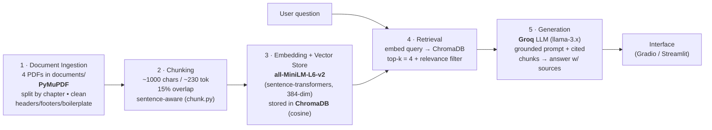

# Project 1 Planning: The Unofficial Guide

> Write this document before you write any pipeline code.
> Your spec and architecture diagram are what you'll use to direct AI tools (Claude, Copilot, etc.) to generate your implementation — the more specific they are, the more useful the generated code will be.
> Update the Retrieval Approach and Chunking Strategy sections if you change your approach during implementation.
> Update this file before starting any stretch features.

---

## Domain

**Clinical & health-science study knowledge — an "unofficial guide" for nursing
and pre-health students.** The system makes a small library of dense, open-access
medical reference texts (microbiology, pharmacology for nurses, surgical care,
and patient-safety/clinical-risk management) instantly queryable in plain
language. This knowledge is *technically* public but practically hard to find:
the answers a student needs are buried across ~3,500 pages of four separate
textbooks with no semantic search, so finding "which drugs treat Parkinson's and
what are their contraindications" or "what does sterile technique require in a
district hospital" means knowing which book, chapter, and page to open. Official
course materials are organized for linear reading, not for asking a specific
question and getting a cited, grounded answer.

**Five specific questions the system should be able to answer:**
1. What are the main classes of antimicrobial drugs and how do they work? *(Microbiology Ch. 14)*
2. What nursing considerations apply when administering anticoagulant or antiplatelet drugs? *(Pharmacology Ch. 20)*
3. How is bacterial meningitis diagnosed and what causes it? *(Microbiology Ch. 26)*
4. What organizational practices reduce human error in patient care? *(Patient Safety Ch. 3)*
5. What are the steps and requirements for safe surgical/sterile technique in a district hospital? *(WHO Surgical Care)*

---

## Documents

<!-- List your specific sources: URLs, subreddit names, forum threads, or file descriptions.
     Aim for at least 10 sources that together cover different subtopics or perspectives within your domain. -->

The corpus is built from **4 open-access reference textbooks** (in `documents/`),
which the ingestion pipeline splits into **111 chapter/section-level documents**.
The table below lists the 4 source texts plus 6 representative chapter-documents
to show subtopic coverage; the full set of 111 is enumerated in
`processed/manifest.json` after running ingestion.

| # | Source | Description | URL or location |
|---|--------|-------------|-----------------|
| 1 | OpenStax *Microbiology* | 26 chapters: microbes, pathogenicity, immunology, organ-system infections | `documents/OpenStax-Microbiology.pdf` — https://openstax.org/details/books/microbiology |
| 2 | OpenStax *Pharmacology for Nurses* | 40 chapters: drug classes, administration, nursing considerations by body system | `documents/OpenStax-Pharmacology-for-Nurses.pdf` — https://openstax.org/details/books/pharmacology-for-nurses |
| 3 | WHO *Surgical Care at the District Hospital* | Surgical service organization, anesthesia, procedures, sterile technique | `documents/surgical-care-at-the-district-hospital-world-health-organization-618.pdf` — https://www.who.int/publications/i/item/9241545755 |
| 4 | Springer *Textbook of Patient Safety and Clinical Risk Management* (open access) | 34 chapters: human error, risk management, safety guidelines | `documents/textbook-of-patient-safety-and-clinical-risk-management-...-621.pdf` — https://link.springer.com/book/10.1007/978-3-030-59403-9 |
| 5 | Microbiology, Ch. 14 — Antimicrobial Drugs | Drug classes & mechanisms of action | `processed/doc-014-*.json` |
| 6 | Microbiology, Ch. 26 — Nervous System Infections | Meningitis etc. diagnosis & causes | `processed/doc-026-*.json` |
| 7 | Pharmacology, Ch. 20 — Anticoagulant/Antiplatelet Drugs | Nursing considerations | `processed/doc-046-*.json` |
| 8 | Pharmacology, Ch. 11 — Parkinson's Disease Drugs | Treatments & contraindications | `processed/doc-037-*.json` |
| 9 | Patient Safety, Ch. 3 — Human Error and Patient Safety | Error-reduction practices | `processed/doc-069-*.json` |
| 10 | WHO Surgical Care — sterile-technique sections | Safe surgical/sterile procedure | `processed/doc-101..111-*.json` |

---

## Chunking Strategy

<!-- How will you split documents into chunks?
     State your chunk size (in tokens or characters), overlap size, and explain why those
     numbers fit the structure of your documents.
     A review-heavy corpus warrants different chunking than a long FAQ. -->

**Chunk size:** ~200 tokens, hard ceiling 256, measured with the embedding
model's own tokenizer. Split on natural boundaries (paragraph → sentence → word
window), never mid-sentence.
> **Updated during implementation:** originally specified as ~1,000 characters.
> Verifying against MiniLM's tokenizer showed clinical text tokenizes much denser
> than ~4 chars/token (drug names → many subwords), so 800-char chunks could hit
> 435 tokens and be truncated. Switched to a **token-aware** chunker so no chunk
> exceeds the 256-token limit. See README → Spec Reflection.

**Overlap:** ~30 tokens (~15%), trimmed to start at a word boundary.

**Reasoning:**
My documents are **long-form expository textbook prose**, not short reviews. A
single fact — a drug's mechanism, a definition with caveats, a procedure's steps
— unfolds across a paragraph or two. Review-style text would warrant tiny
~200-char chunks, but cutting dense reference text that fine scatters one
concept across many chunks and breaks the reasoning an answer needs.

The hard ceiling on chunk size comes from the **embedding model**:
`all-MiniLM-L6-v2` has a **256-token max sequence length** and silently
truncates anything longer. If I chunked at 3,000+ characters, ~70% of each
chunk would be dropped before it was ever embedded, so the vector would
misrepresent the text and retrieval would degrade. I therefore size chunks just
under that limit (~1,000 chars ≈ 230 tokens) — large enough to hold a complete
idea, small enough that the embedding model encodes the *whole* chunk.

**Overlap** matters because clinical facts straddle boundaries (a drug name in
one paragraph, its contraindication in the next). A ~15% overlap means a fact
split across a cut still appears whole in at least one chunk, improving recall
without much duplication.

**How I'll know the size is wrong:**
- *Too small* — answers come back fragmentary; retrieval returns the drug name
  but not its dosage/contraindication; the model says "the context doesn't say."
- *Too large* — retrieved chunks are topically diffuse (low precision), and/or
  embedding truncation means the back half of long chunks is never matched.

Preprocessing before chunking (done in ingestion): strip running
headers/footers, page numbers, and publisher boilerplate; de-hyphenate
line-break splits; repair soft-wrapped lines; normalize Unicode.

---

## Retrieval Approach

<!-- Which embedding model are you using (e.g., all-MiniLM-L6-v2 via sentence-transformers)?
     How many chunks will you retrieve per query (top-k)?
     If you were deploying this for real users and cost wasn't a constraint, what tradeoffs
     would you weigh in choosing a different embedding model — context length, multilingual
     support, accuracy on domain-specific text, latency? -->

**Embedding model:** `all-MiniLM-L6-v2` via `sentence-transformers` (384-dim,
runs locally, no API cost). Vectors stored in **ChromaDB** (cosine distance).

**Top-k:** 4 chunks per query.
- Too few (k=1) risks missing the chunk that holds the answer, especially when a
  fact is split across an overlap boundary.
- Too many (k=10+) floods the LLM prompt with diffuse, partly-irrelevant context,
  which dilutes grounding and raises token cost/latency.
- k=4 gives the model enough corroborating context to answer (and to cite
  multiple chapters when relevant) while staying focused. I'll filter out chunks
  whose similarity is below a relevance threshold so weak matches don't pad the
  prompt.

Semantic search works here because it matches on **meaning, not exact words**:
a query like "drugs for shaking and tremor in Parkinson's" can retrieve a chunk
that says "antiparkinsonian agents reduce resting tremor" even with zero shared
keywords, because both map to nearby points in embedding space.

**Production tradeoff reflection (if cost weren't a constraint):**
- **Accuracy on domain text:** MiniLM is a small general-purpose model. For
  clinical text I'd evaluate a domain-tuned encoder (e.g. a biomedical/PubMedBERT
  embedding model) that better separates near-synonym drug/disease terms.
- **Context length:** MiniLM's 256-token cap forces small chunks. A long-context
  embedding model (e.g. an OpenAI `text-embedding-3` or BGE-M3, 8k tokens) would
  let me embed whole chapter-sections without truncation, capturing more context
  per vector — at the cost of API dependency and per-call pricing.
- **Latency / local vs. hosted:** MiniLM is fast and local (private, free, no
  rate limits) — ideal for a student tool. A hosted API would add network
  latency and a privacy consideration for any sensitive queries, in exchange for
  higher accuracy.
- **Multilingual:** not needed here (English texts), but a multilingual model
  (BGE-M3) would matter if I added non-English sources.

---

## Evaluation Plan

<!-- List your 5 test questions with their expected correct answers.
     Questions should be specific enough that you can judge whether the system's response
     is right or wrong. "What are good dining halls?" is too vague.
     "What do students say about wait times at [dining hall name] during lunch?" is testable. -->

| # | Question | Expected answer |
|---|----------|-----------------|
| 1 | What are the major classes of antimicrobial drugs, and what cellular target does each act on? | Should name classes such as cell-wall synthesis inhibitors (β-lactams/penicillins, cephalosporins), protein synthesis inhibitors (aminoglycosides, tetracyclines, macrolides), nucleic-acid synthesis inhibitors (fluoroquinolones, rifampin), and metabolic/folate inhibitors (sulfonamides), each tied to its target. *(Microbiology Ch. 14)* |
| 2 | What nursing considerations and patient-monitoring apply when administering warfarin (an anticoagulant)? | Should mention monitoring INR/PT, bleeding-risk assessment, vitamin K as antidote/dietary interaction, and avoiding concurrent drugs that increase bleeding. *(Pharmacology Ch. 20)* |
| 3 | What are the common causes of bacterial meningitis and how is it diagnosed? | Causes include *Neisseria meningitidis*, *Streptococcus pneumoniae*, *Haemophilus influenzae* (and *Listeria* in some groups); diagnosis via lumbar puncture / CSF analysis (cell count, Gram stain, culture, glucose/protein). *(Microbiology Ch. 26)* |
| 4 | According to the patient-safety text, what distinguishes active errors from latent conditions in healthcare? | Active errors are unsafe acts by front-line staff with immediate effects; latent conditions are upstream system/organizational weaknesses (staffing, design, policy) that lie dormant until they contribute to harm (Reason's model). *(Patient Safety Ch. 3)* |
| 5 | What does the WHO guidance say is required to maintain sterile technique / asepsis during surgery at a district hospital? | Should cover sterilization of instruments, hand scrubbing, sterile gowns/gloves and drapes, maintaining the sterile field, and skin antisepsis. *(WHO Surgical Care)* |

---

## Anticipated Challenges

<!-- What could go wrong? Name at least two specific risks with reasoning.
     Consider: noisy or inconsistent documents, missing source attribution, off-topic
     retrieval, chunks that split key information across boundaries. -->

1. **Embedding truncation from oversized chunks.** `all-MiniLM-L6-v2` truncates
   past 256 tokens. If my chunker produces chunks larger than that (easy to do
   with dense textbook paragraphs), the tail of each chunk is never embedded, so
   facts in the back half become unretrievable even though they're "in the
   index." Mitigation: cap chunk size ~230 tokens and log the chunk-size
   distribution after chunking.

2. **Key facts split across a chunk boundary.** A drug and its contraindication,
   or a disease and its diagnostic test, can land in adjacent chunks; retrieval
   may return only one, leaving the model without enough to answer. Mitigation:
   ~15% overlap, sentence-aware splitting, and retrieving top-k=4 so neighboring
   chunks are likely both pulled in.

3. **PDF extraction noise / cross-document term collision.** Textbook PDFs carry
   running headers, page numbers, figure captions, and license boilerplate that
   pollute chunks and embeddings; and the four books share vocabulary (e.g.
   "infection," "drug"), so a query may retrieve a topically-similar chunk from
   the *wrong* book. Mitigation: aggressive cleaning in ingestion, plus
   per-chunk source/chapter/page metadata so retrieval results are attributable
   and the model can cite where each fact came from.

---

## Architecture

<!-- Draw a diagram of your pipeline showing the five stages:
     Document Ingestion → Chunking → Embedding + Vector Store → Retrieval → Generation
     Label each stage with the tool or library you're using.
     You can use ASCII art, a Mermaid diagram, or embed a sketch as an image.
     You'll use this diagram as context when prompting AI tools to implement each stage. -->



Plain-text fallback:

```
documents/*.pdf
   │  (PyMuPDF: load, split by chapter, clean)
   ▼
[1] Ingestion ──► processed/*.json + manifest.json
   │  (chunk.py: ~1000-char, 15% overlap, sentence-aware)
   ▼
[2] Chunking ──► chunks.jsonl
   │  (sentence-transformers: all-MiniLM-L6-v2, 384-dim)
   ▼
[3] Embedding + Vector Store ──► ChromaDB (cosine)
   ▲                                  │
   │ embed query                      │ top-k=4 + relevance filter
User question ─────────────► [4] Retrieval
                                      │  (retrieved chunks + metadata)
                                      ▼
                              [5] Generation ──► Groq LLM (grounded, cited)
                                      ▼
                              Gradio / Streamlit UI
```

---

## AI Tool Plan

<!-- For each part of the pipeline below, describe:
     - Which AI tool you plan to use (Claude, Copilot, ChatGPT, etc.)
     - What you'll give it as input (which sections of this planning.md, which requirements)
     - What you expect it to produce
     - How you'll verify the output matches your spec

     "I'll use AI to help me code" is not a plan.
     "I'll give Claude my Chunking Strategy section and ask it to implement chunk_text()
     with my specified chunk size and overlap" is a plan. -->

**Milestone 3 — Ingestion and chunking:**
Tool: **Claude**. Input: the Domain, Documents, and Chunking Strategy sections
of this file, plus the requirement that chunks stay ≤256 tokens for MiniLM.
Expected output: a `chunk_text(text)` function that splits on
paragraph→sentence boundaries at ~1,000 chars with ~150-char overlap and a
hard word-cut fallback, plus the ingestion code that loads each PDF with
PyMuPDF, splits by TOC chapter, cleans headers/footers/boilerplate, and writes
structured JSON. Verify: run it and inspect the chunk-size distribution
(min/avg/max chars) and spot-check 3 chunks for clean text and no mid-sentence
cuts; confirm max chunk ≤ ~256 tokens.

**Milestone 4 — Embedding and retrieval:**
Tool: **Claude/Copilot**. Input: the Retrieval Approach section (model
`all-MiniLM-L6-v2`, ChromaDB, top-k=4, relevance filter) and the chunk JSON
schema. Expected output: code that embeds every chunk with
sentence-transformers, upserts them into a persistent ChromaDB collection with
their metadata, and a `retrieve(query, k=4)` function that embeds the query and
returns the top chunks above a similarity threshold. Verify: run my 5 eval
questions and confirm the returned chunks come from the expected chapters
(per the Evaluation Plan).

**Milestone 5 — Generation and interface:**
Tool: **Claude**. Input: the Grounded Generation goals and an instruction that
the model must answer *only* from retrieved chunks and cite source/chapter.
Expected output: a prompt template that injects the formatted, cited chunks and
a system instruction enforcing grounding ("if the context doesn't contain the
answer, say so"), a Groq chat call, and a minimal Gradio/Streamlit UI. Verify:
ask an in-domain question (should answer with citations) and an out-of-domain
question (should refuse / say not covered) to confirm grounding holds.
